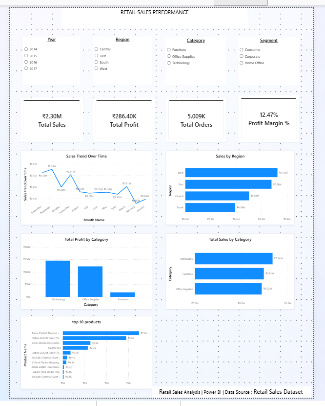
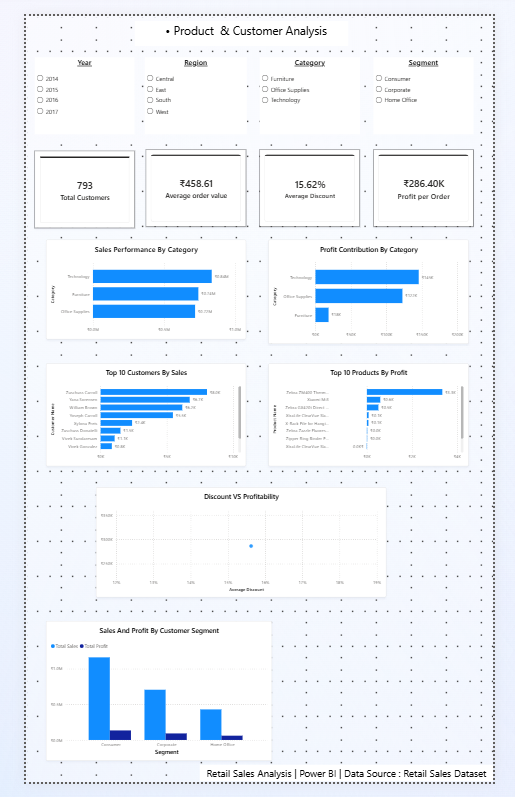
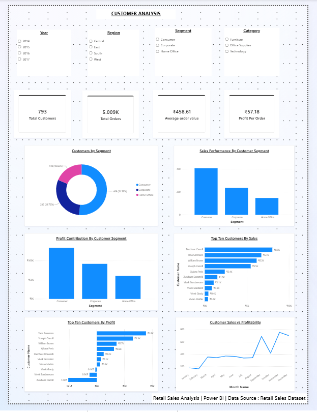

# Retail Sales Dashboard

A Power BI dashboard project focused on analyzing retail sales performance, profitability, customer segments, regional performance, category performance, and seasonal order trends.

This project demonstrates practical skills in **Power BI, DAX, Power Query, data modeling, and business analysis**.

---

## 📌 Project Overview

The **Retail Sales Dashboard** provides an interactive view of retail business performance using sales, profit, customer, order, category, regional, and seasonal data.

The dashboard helps transform raw retail sales data into meaningful business insights that can support data-driven decision-making.

### Key Areas Analyzed

* Sales performance
* Profitability
* Customer segments
* Regional performance
* Product category performance
* High-value customers
* Order volume
* Seasonal trends
* Business performance KPIs

---

## 🎯 Business Objective

The main objective of this project is to analyze retail sales data and identify important patterns in:

* Sales and profit performance
* Category-level performance
* Customer segment contribution
* Regional sales performance
* High-value customers
* Seasonal order trends
* Overall business profitability

The analysis also provides business recommendations based on the dashboard findings.

---

## 📊 Key KPIs

| KPI                 |    Value |
| ------------------- | -------: |
| Total Sales         |   ₹2.30M |
| Total Profit        | ₹286.40K |
| Total Customers     |      793 |
| Profit Margin       |   12.47% |
| Profit Per Order    |   ₹57.18 |
| Average Order Value |  ₹458.61 |

---

## 🔍 Key Business Insights

### 1. Regional Performance

* **West** is the leading region in sales.
* **South** has the lowest sales performance.
* Regional sales performance follows the order:

**West → East → Central → South**

This indicates uneven regional performance and suggests that the South region requires further investigation.

---

### 2. Category Performance

* **Technology** is the strongest category in terms of sales and profit.
* **Furniture** has the lowest profit contribution.
* Strong sales performance does not necessarily result in proportional profitability.

This highlights the importance of analyzing both sales and profit when evaluating category performance.

---

### 3. Customer Segment Performance

| Customer Segment | Customers |  Share |
| ---------------- | --------: | -----: |
| Consumer         |       409 | 51.58% |
| Corporate        |       236 | 29.75% |
| Home Office      |       148 | 18.66% |

* **Consumer** is the largest customer segment.
* Consumer customers are also the strongest contributors to sales and profit.
* Corporate is the second-largest segment.
* Home Office is the smallest segment.

---

### 4. High-Value Customers

The analysis identifies high-value customers based on their contribution to business profit.

Some of the high-value customers include:

* Yana Sorensen
* Yoseph Carroll
* William Brown

A relatively small group of customers contributes significantly to sales and profit, making customer retention and targeted engagement important business opportunities.

---

### 5. Order Volume Seasonality

* **November** has the highest order volume with **753 orders**.
* **February** has the lowest order volume with **162 orders**.

This indicates potential seasonal patterns that may affect inventory planning, staffing, and promotional activities.

---

### 6. Overall Profitability

The business generated:

* **₹2.30M Total Sales**
* **₹286.40K Total Profit**
* **12.47% Profit Margin**
* **₹57.18 Profit Per Order**
* **₹458.61 Average Order Value**

The dashboard provides an overall view of business profitability while highlighting areas where sales growth and profitability can be further improved.

---

## 💡 Business Recommendations

### Sales Growth

Focus growth initiatives on high-performing categories, particularly **Technology**, while identifying opportunities to improve weaker-performing categories.

### Profitability

Monitor **profit margin** and **profit per order** alongside sales. Review low-profit categories such as **Furniture** to improve overall profitability.

### Customer Strategy

Prioritize retention and targeted engagement for **high-value customers** and the **Consumer segment**, while developing strategies to increase the value of Corporate and Home Office customers.

### Regional Improvement

Investigate the lower sales performance of the **South region** by analyzing:

* Product mix
* Customer segments
* Discounts
* Sales trends

### Seasonal Planning

Prepare inventory and operational resources for high-demand periods such as **November**, while using targeted promotions to stimulate demand during lower-order periods such as **February**.

---

## 🛠️ Tools & Technologies

* **Power BI**
* **DAX**
* **Power Query**
* **Data Modeling**
* **Data Visualization**
* **Business Intelligence**
* **Data Analysis**

---

## 📐 DAX Measures

The project uses DAX measures to calculate important business KPIs and analytical metrics.

Some of the measures include:

* Total Sales
* Total Profit
* Total Customers
* Total Orders
* Total Quantity
* Average Order Value
* Average Discount
* Profit Margin %
* Profit Per Order
* Sales Growth %
* Sales Previous Year

The complete list of DAX measures and their explanations is available in:

📁 `DAX/Measures.md`

---

## 📊 Power BI Dashboard

The Power BI dashboard contains multiple pages covering different aspects of retail business performance.

### Dashboard Page 1



### Dashboard Page 2



### Dashboard Page 3



---

## 📁 Project Structure

```text
Retail_Sales_PowerBI_Dashboard/
│
├── Dataset/
│   └── Retail_Sales.csv
│
├── Powerbi/
│   └── Retail_sales_performance.pbix
│
├── screenshots/
│   ├── Dashboard_page1.png
│   ├── Dashboard_page2.png
│   └── Dashboard_page3.png
│
├── DAX/
│   └── Measures.md
│
├── Business_Insights/
│   └── B_Insights
│
├── Business_Recommendations/
│   └── B_Recommendations
│
└── README.md
```

---

## 🚀 How to Use

1. Download or clone this repository.
2. Open the Power BI file:

```text
Powerbi/Retail_sales_performance.pbix
```

3. Open the dashboard in **Microsoft Power BI Desktop**.
4. Interact with the available visuals, filters, and slicers.
5. Review the DAX measures and business insights for additional analysis.

---

## 📄 Project Files

| Folder/File                                  | Description                                    |
| -------------------------------------------- | ---------------------------------------------- |
| `Dataset/Retail_Sales.csv`                   | Retail sales dataset                           |
| `Powerbi/Retail_sales_performance.pbix`      | Power BI dashboard file                        |
| `screenshots/`                               | Dashboard screenshots                          |
| `DAX/Measures.md`                            | DAX measures and explanations                  |
| `Business_Insights/B_Insights`               | Business insights from the dashboard           |
| `Business_Recommendations/B_Recommendations` | Business recommendations based on the analysis |

---

## 📌 Project Type

**Data Analyst / Business Intelligence Project**

This project demonstrates practical experience in:

* Data analysis
* Business reporting
* KPI development
* DAX
* Power BI dashboards
* Data modeling
* Business insights
* Data-driven recommendations

---

## 👨‍💻 Author

**Sumit Juwar**

BCom Computer Application Student
Aspiring Data Analyst

---

⭐ If you find this project useful, feel free to explore the repository and dashboard files.

